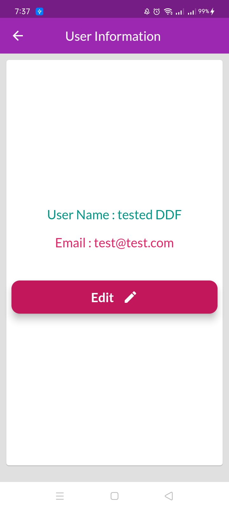
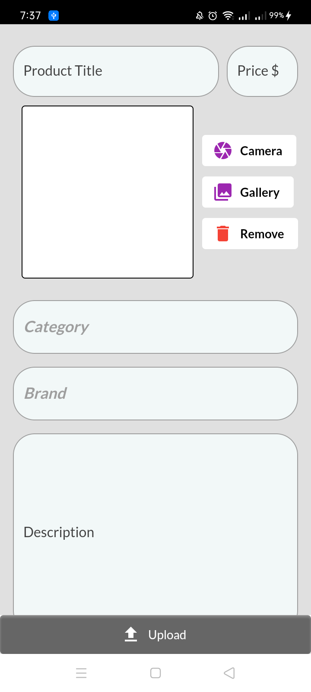

# E-Commerce-App

##  E-cmmerce application for online shopping

<table style="width:100%" >
  <tr> 
   <th>   <h2>Splash Screen</h2>   </th> 
  <tr/>
  <tr>
    <th></th>
  </tr>

  <tr>  
   <th>   <h2>Login Screen</h2> </th>
  <tr/>
  <tr>
   <th></th>
  </tr>

  <tr>  
   <th>   <h2>Sign Up Screen</h2> </th>
  <tr/>
  <tr>
   <th></th>
  </tr>

  <tr>  
   <th>   <h2>Home Screen</h2> </th>
  <tr/>
  <tr>
   <th></th>
  </tr>

  <tr>  
   <th>   <h2>Categories Screen</h2> </th>
  <tr/>
  <tr>
   <th></th>
  </tr>

   

  <tr>  
   <th>   <h2>Brands Screen</h2> </th>
  <tr/>
  <tr>
   <th></th>
  </tr>

  <tr>  
   <th>   <h2>Product Details Screen</h2> </th>
  <tr/>
  <tr>
   <th></th>
  </tr>

​      

  <tr>  
   <th>   <h2>Product Screen</h2> </th>
  <tr/>
  <tr>
   <th></th>
  </tr>

  <tr>  
   <th>   <h2>Cart Screen</h2> </th>
  <tr/>
  <tr>
   <th></th>
  </tr>

  <tr>  
   <th>   <h2>Orders Screen</h2> </th>
  <tr/>
  <tr>
   <th></th>
  </tr>
    
  <tr>  
   <th>   <h2>Profile Screen</h2> </th>
  <tr/>
  <tr>
   <th></th>
  </tr>  

<tr>  
   <th>   <h2>Address Screen</h2> </th>
  <tr/>
  <tr>
   <th></th>
  </tr>

<tr>  
   <th>   <h2>Add Address Screen</h2> </th>
  <tr/>
  <tr>
   <th></th>
  </tr>

<tr>  
   <th>   <h2>User Information Screen</h2> </th>
  <tr/>
  <tr>
   <th></th>
  </tr>

<tr>  
   <th>   <h2>Edit Profile Screen</h2> </th>
  <tr/>
  <tr>
   <th></th>
  </tr>

<tr>  
   <th>   <h2>Drawer Screen</h2> </th>
  <tr/>
  <tr>
   <th></th>
  </tr>

<tr>  
   <th>   <h2>Upload Product Screen</h2> </th>
  <tr/>
  <tr>
   <th></th>
  </tr>

<tr>  
   <th>   <h2>Contant Us Screen</h2> </th>
  <tr/>
  <tr>
   <th></th>
  </tr>

</table>

# Package

## Firebase 

### cloud_firestore:

### firebase_auth: 

### firebase_core:

### firebase_storage:

## localization

### easy_localization: 

## Apis

### dio: 

### json_annotation:

### cached_network_image:

## State Management

### flutter_riverpod:

## storge

### shared_preferences

## splash Screen

### flutter_native_splash:

## Ui 

### awesome_dialog: 

### card_swiper: 

### carousel_pro_nullsafety: 

### fluttericon: 

### fluttertoast: 

### image_cropper: 

### image_picker:

### list_tile_switch: 

### url_launcher: 

### uuid: 

