

  
  
  
# E-Commerce-App

##  E-cmmerce application for online shopping

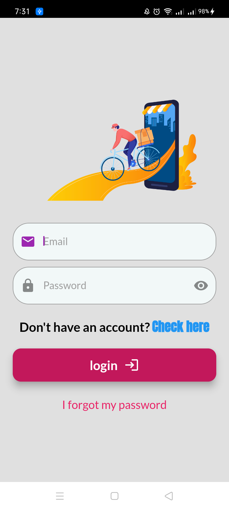
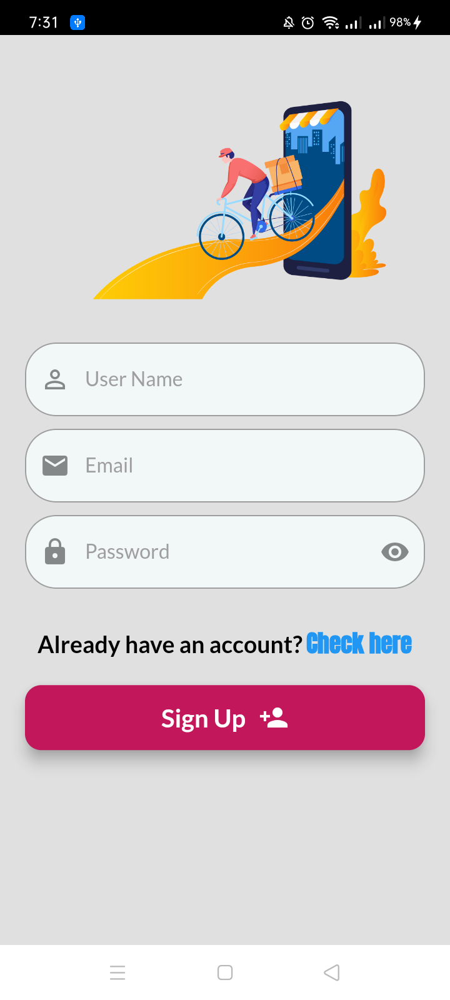
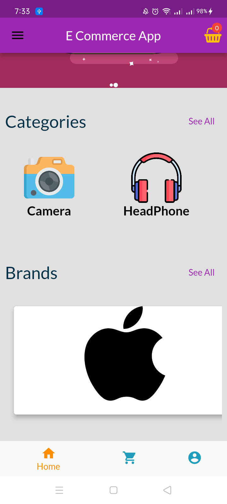
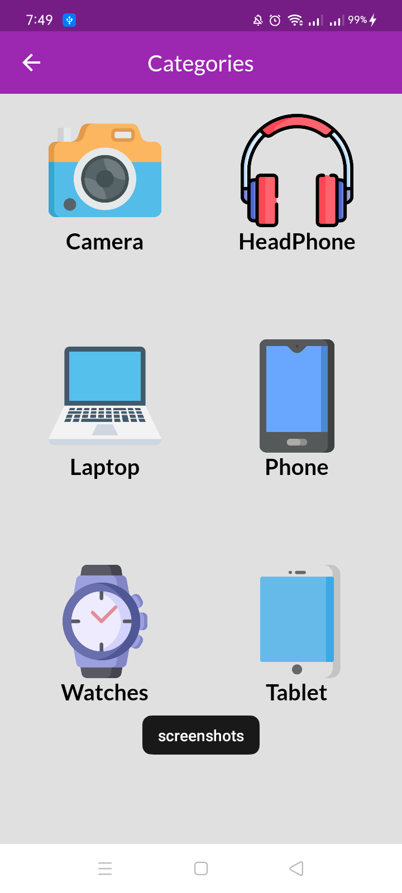
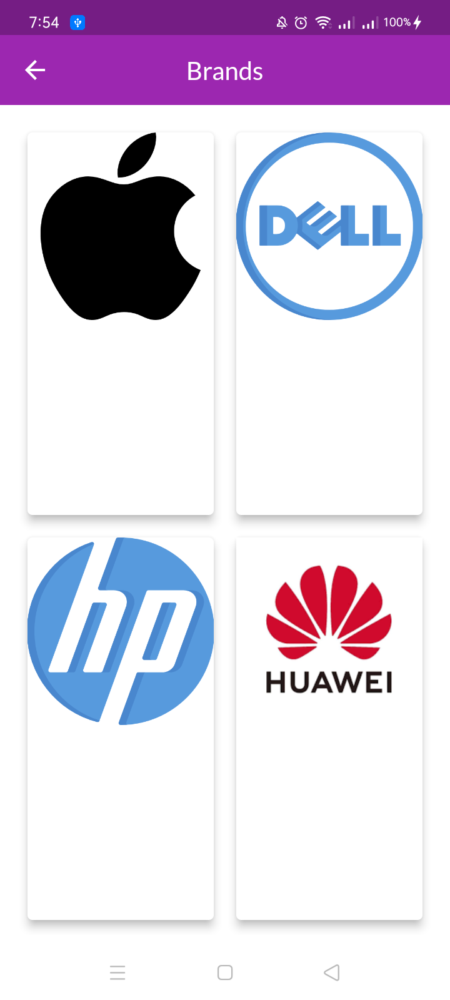
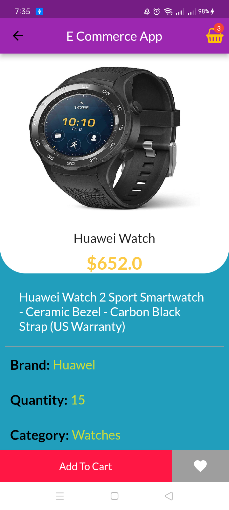
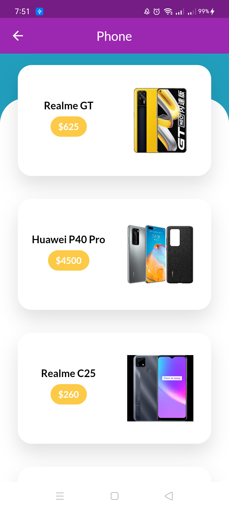
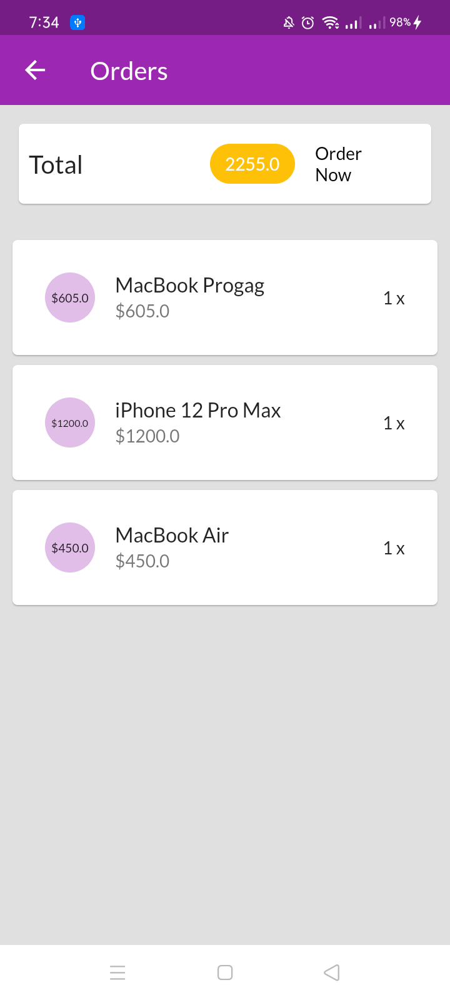
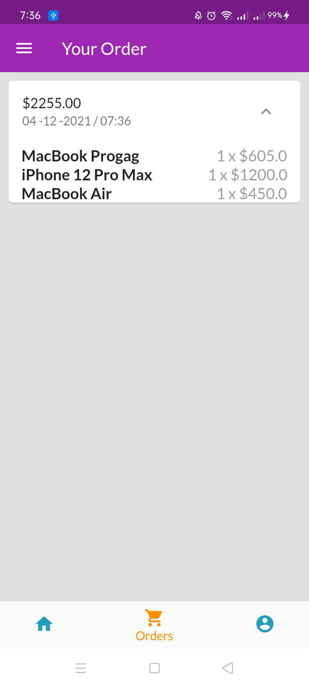

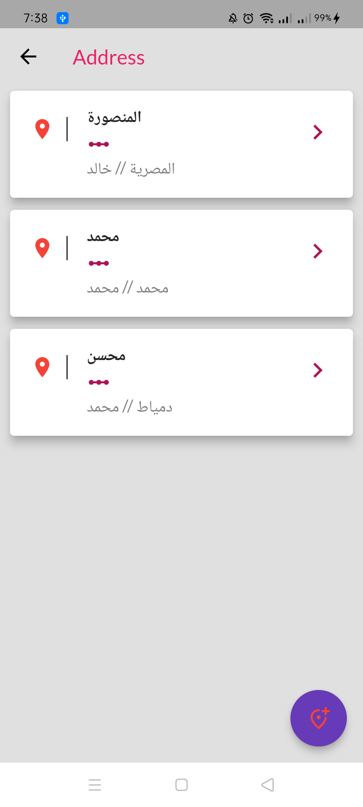
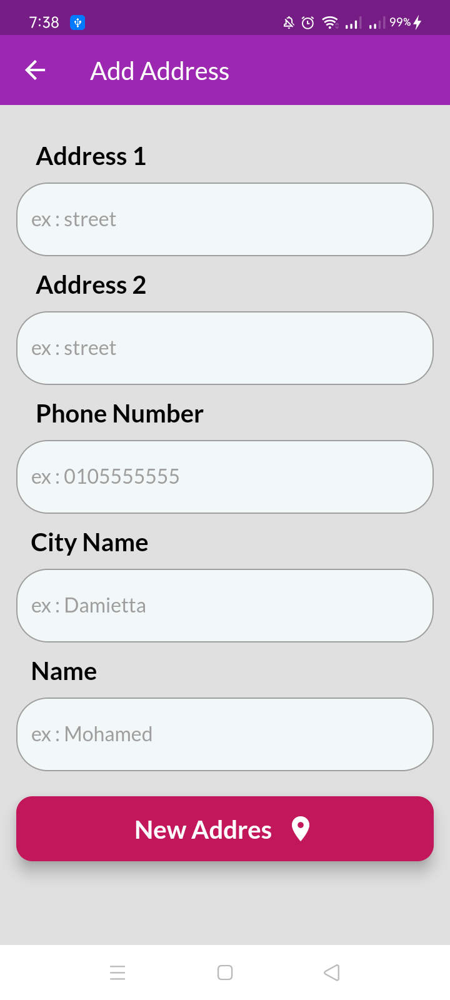
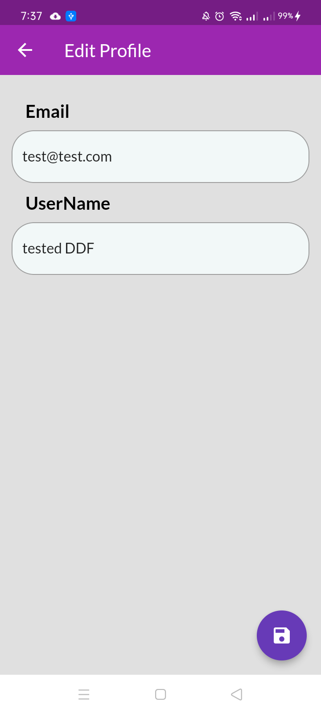
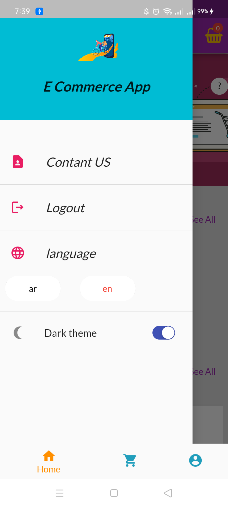
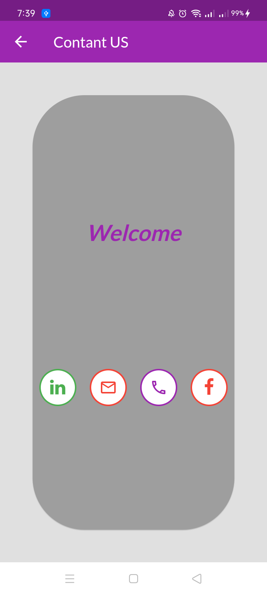

# Package

## Firebase 

### cloud_firestore:

### firebase_auth: 

### firebase_core:

### firebase_storage:

## localization

### easy_localization: 

## Apis

### dio: 

### json_annotation:

### cached_network_image:

## State Management

### flutter_riverpod:

## storge

### shared_preferences

## splash Screen

### flutter_native_splash:

## Ui 

### awesome_dialog: 

### card_swiper: 

### carousel_pro_nullsafety: 

### fluttericon: 

### fluttertoast: 

### image_cropper: 

### image_picker:

### list_tile_switch: 

### url_launcher: 

### uuid: 

